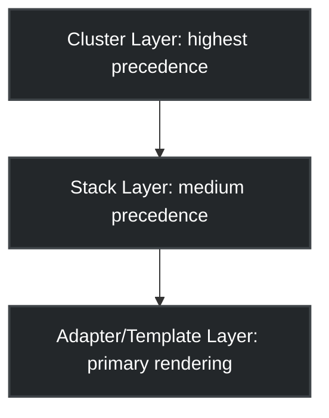

# Configuration Unification is a Lie: Enter MXC, the Declarative CUE-Based GitOps Engine

> "Application configuration will never be unified. Deployment configuration must be."

If you’ve spent any time operating Kubernetes in production, you’ve hit the Wall of YAML. Helm charts nested inside other Helm charts, Kustomize overlays overriding overlays, and a sea of copy-pasted boilerplate that slowly drifts across dev, staging, and production environments. 

Most platform engineering teams try to solve this with more template processing, leading to the infamous "Kubernetes configuration tax" where engineers spend more time writing string-replacement logic than writing core application code.

In this article, we'll dive deep into **MXC (Model-driven Configuration Unification)**, a revolutionary declarative GitOps engine we designed for our home lab and enterprise infrastructure (`cluster-home-mxc`). Driven by **CUE (Configure, Unify, Execute)** and integrated with **Kluctl** and **Woodpecker CI/CD**, MXC demonstrates how we can move away from text-templating hacks and towards a strongly typed, validated, and model-driven GitOps topology.

---

## Slide 3 — CUE Features We Use

Before we delve into the architectural design, it is helpful to visualize the powerful CUE features that the MXC engine utilizes to deliver safe, declaratively robust configurations.

```
┌─────────────────────────────────────────────────────────────────────────────┐
│  FEATURE               WHAT IT GIVES US            WHERE WE USE IT         │
├─────────────────────────────────────────────────────────────────────────────┤
│  Definitions           Typed schemas               #App, #CeSite,          │
│  #Name: {...}          validated at eval            #StackDns, #Topology    │
├─────────────────────────────────────────────────────────────────────────────┤
│  Unification           Merge structs with          #CeSite & #StackDns     │
│  (#A & #B)             type-safe constraint         context merge into apps │
├─────────────────────────────────────────────────────────────────────────────┤
│  Defaults              Overridable values          *"kafka:9092" | string  │
│  (*value | type)       consumer narrows only       consumer sets concrete  │
├─────────────────────────────────────────────────────────────────────────────┤
│  String interpolation  Computed fields from        Fqdn: "\(AppName).\(    │
│  "\(expr)"             sibling values              ClusterName).\(Suffix)" │
├─────────────────────────────────────────────────────────────────────────────┤
│  Pattern constraints   Schema for dynamic keys     [=~"^dns-\\d+$"]: {..} │
│  [pattern]: {...}      apply to matching fields     topology CE instances   │
├─────────────────────────────────────────────────────────────────────────────┤
│  Optional fields       Omit from export when       AppInstance?: string    │
│  name?: type           unset — renderapp injects   TenantName?: string     │
├─────────────────────────────────────────────────────────────────────────────┤
│  @embed(file=...)      Import YAML into CUE        domain/env/params.yaml  │
│                        at eval time — no codegen   domain/net/ (planned)   │
├─────────────────────────────────────────────────────────────────────────────┤
│  Disjunctions          Constrained enums           flavor: *"prod"|"test"  │
│  (a | b | c)           validated at eval            site type constraints   │
├─────────────────────────────────────────────────────────────────────────────┤
│  Dynamic lookup        Index struct by field       _flavor.sizing[         │
│  struct[key]           value at eval time            flavor.sizing]         │
├─────────────────────────────────────────────────────────────────────────────┤
│  @stack(dns)           Metadata attributes         Build-time prefix tag   │
│  CUE attributes        travel through unification  future: K8s labels      │
├─────────────────────────────────────────────────────────────────────────────┤
│  OCI module registry   Versioned upstream schemas  cue.dev/x/k8s.io       │
│  cue.dev/x/...         importable dependencies     ArgoCD, Kyverno (plan) │
├─────────────────────────────────────────────────────────────────────────────┤
│  cue export openapi    Bidirectional schema        Generate OpenAPI docs   │
│                        CUE ↔ OAS/JSON Schema       Import Netbox OAS      │
├─────────────────────────────────────────────────────────────────────────────┤
│  cue cmd               CUE tool commands —         fetch-netbox (planned)  │
│  (tool/exec, tool/http) run scripts/APIs from CUE  generate-context (plan) │
│                        pipeline: fetch → validate   import + output in one │
└─────────────────────────────────────────────────────────────────────────────┘
```

### The Mathematics of Validation: The Turned-T Operator (`⊥`)

To understand how CUE guarantees security, we must briefly look at its mathematical foundations. Unlike scripting languages that execute sequentially, CUE is based on **Lattice Theory**. It models types and values within a single, ordered algebraic structure.

In CUE, types are values, and values are types. The universe of possibilities starts at the Top element (`⊤`—representing all possible, unconstrained data) and terminates at the **Bottom** element (`⊥`—represented by a literal "T" turned 180 degrees). 

```
     Top ( ⊤ )      <-- Anything / Unconstrained
       /   \
   string   int     <-- Type constraints
     /       \
  "dev"       42    <-- Concrete values
     \       /
   Bottom ( ⊥ )     <-- Error / logical conflict / "Turned-T"
```

The Turned-T (`⊥`) represents a logical contradiction, validation failure, or schema conflict. When we merge two structures using the **Unification** operator (`&`), the CUE compiler performs a "meet" operation on the lattice.

### Core Lattice Operators in CUE

| Operator / Concept | Lattice Representation | CUE Syntax | Practical Meaning / Behavior | Example | Evaluated Output |
| :--- | :---: | :---: | :--- | :--- | :--- |
| **Top (`⊤`)** | Highest Element (any value) | `_` (underscore) | Completely unconstrained. Any type or value satisfies this. | `x: _` | Any valid JSON structure |
| **Bottom (`⊥`)** | Lowest Element (error) | (Compile error) | Represents a type collision, constraint violation, or logical conflict. | `x: string & 42` | `⊥` (Bottom / Compilation Failure) |
| **Meet (Unification)** | Greatest Lower Bound (GLB) | `&` | Combines two separate constraints or values into a single, merged contract. | `x: string & "dev"` | `"dev"` |
| **Join (Disjunction)** | Least Upper Bound (LUB) | `\|` | Represents a choice between multiple alternatives (constrained options/enums). | `x: "prod" \| "test"` | `"prod" \| "test"` |
| **Subtyping (Constraint)** | Relation (`A ⊑ B`) | `:` (colon) | Asserts that a value or concrete struct satisfies a schema definition. | `x: #App` | Validated at build-time |
| **Default Choice** | Primary preference pointer | `*default \| type` | Defines a default value to be used if no overriding choice is supplied. | `x: *"small" \| string` | `"small"` (defaults to `"small"`) |

If we attempt to unify a field declared as `CpuLimit: #CpuQuantity` (e.g., matching a string pattern like `"500m"`) with a conflicting raw integer value `42`, the mathematical intersection collapses into `⊥` (Bottom). CUE prevents the compilation from succeeding and flags the exact line of the type collision instantly. By making our configurations mathematically sound, CUE ensures that a path leading to `⊥` is caught at compile-time—long before deployment payloads reach the cluster.

---

## The Core Philosophy: Decoupling Intent from Implementation

At the heart of the MXC project is a critical architectural decision: **Application configuration will never be unified. Deployment configuration must be.**

Applications have incredibly diverse runtime needs. A media server like Emby needs raw hardware GPU acceleration, Home Assistant (`hass`) requires host-path Bluetooth sockets, a database needs specific volume provisioning, and a game namespace needs isolated egress-blocking policies. Trying to force all of these applications to use a single, unified YAML template is an exercise in futility.

Instead, MXC establishes a declarative hierarchy across three separate layers:



1. **Cluster Layer (`cluster-home-mxc/`):** Environment-specific operational parameters (VLAN VIPs, ingress domains, persistent storage classes, secrets).
2. **Stack Layer (`mxc/stack/`):** Reusable service compositions (monitoring stacks, media workloads, gateway services). The stack layer defines *sizing, features, and defaults*.
3. **Adapter Layer (`template/kluctl/`):** Simple Jina/Kluctl adapters that convert CUE-validated configuration outputs directly into native Helm charts or Kubernetes resource manifests.

By using **CUE** as our core configuration kernel, we treat our infrastructure as a compile-time codebase. CUE is a constraint-based data validation language that is a superset of JSON. It allows us to merge values, define strict type constraints, and generate fully validated configurations before a single line of YAML is applied to our cluster.

---

## Architectural Inspiration: The K0rdent Influence

When designing the lifecycle and structural layout of the MXC platform, we drew inspiration from cloud-native cluster management systems like **K0rdent**. K0rdent treats infrastructure as distinct service profiles and cluster templates that decouple bare-metal/virtual resource provisioning from service-layer deployments.

In MXC, we model our clusters similarly. A cluster is not defined by raw YAML resource definitions. Instead, a cluster is represented as a single, compiled CUE schema (`#ClusterConfig`) that models cluster network identities, storage providers, and service allocations. This allows us to instantiate an entire cluster profile in a few lines of declarative CUE, which is then projected into our underlying Kluctl deployment paths.

---

## The Power of CUE: 13 Real-World Design Patterns

To understand why CUE is a paradigm shift, let's explore 13 concrete design patterns implemented within the MXC codebase, demonstrating how CUE replaces templating boilerplate with structural, typed logic.

---

### Phase 1: Safe Data Ingestion & Transformation

#### Pattern 1: Embedding YAML directly into CUE
The MXC library modules can embed shared raw static assets (like parameter maps or base image lists) directly into the compiler. This is where CUE stops being "just another language" and becomes a practical data integration layer.

```cue
@extern(embed)

package env

import "mxc/pkg/envsubst"

_params: _ @embed(file="params.yaml")
_images: _ @embed(file="images.yaml")
```

This is an exceptionally strong pattern for configuration management:
* Keep external source data in YAML when that is the most natural format (e.g., vendor lists, legacy charts).
* Load it directly into CUE.
* Apply type constraints and transformations.
* Export cleanly when done.

#### Pattern 2: Reconstructing values with internal transformation logic
When raw data is embedded, values arrive as plain strings. If those strings contain environment variables (`$VAR`) or composite references, you need a way to resolve them safely. 

MXC achieves this via an internal CUE utility package, `mxc/pkg/envsubst/envsubst.cue`:

```cue
package envsubst

#Resolve: {
    #base:     _
    #override: _

    // merge base values and overrides
    // normalize them into strings
    // resolve composed references into final output
}
```

This utility is then consumed directly within our defaults definition:

```cue
_base: {
    for k, v in _params {(k): v}
    for k, v in _images {(k): v}
}

_resolved: (envsubst.#Resolve & {#base: _base, #override: {}}).out
```

Historically, writing this type of typed glue code was a high-friction adoption barrier. With AI-assisted development, however, these robust boilerplate structures can be generated in seconds, giving platform teams type-safe reference lookup engines without manual maintenance overhead.

---

### Phase 2: Modeling Identity & Structure

#### Pattern 3: A shared application schema with computed fields
Platform engineers typically spread naming conventions, DNS patterns, and ingress rules across dozens of files, wiki pages, and pipelines. MXC consolidates this into a single, shared base schema in `mxc/schema/apps.cue`:

```cue
#App: k8s.#FieldSchemas & {
    AppName:         string
    AppInstance?:    string
    ClusterName:     *env.GC_NAME | string
    InternalDomain:  *env.FABRIC_DOMAIN | string
    Environment:     *"$ENV_NAME" | string
    TenantName?:     string
    FqdnSuffix:      *InternalDomain | string
    Fqdn:            "\(AppName).\(ClusterName).\(FqdnSuffix)"
}
```

This ensures a single, immutable contract:
* One place to enforce naming conventions.
* One place to define operational defaults.
* Every single microservice instantly inherits the identical configuration structure.

#### Pattern 4: Helper packages for naming and identity
To avoid code duplication, MXC maintains focused helper packages. For example, `mxc/pkg/identity.cue` exposes a clean `#AppIdentity` block:

```cue
package mxc

import "mxc/domain/env"

#AppIdentity: {
    #instance:   string
    #cluster:    *env.GC_NAME | string
    #fqdnSuffix: *env.FABRIC_DOMAIN | string

    out: {
        AppName:     #instance
        ClusterName: #cluster
        FqdnSuffix:  #fqdnSuffix
        Fqdn:        "\(#instance).\(#cluster).\(#fqdnSuffix)"
    }
}
```

#### Pattern 5: Thin consumer overrides
One of the most elegant outcomes of this architectural model is how thin the final cluster-instantiation files remain. The shared library owns the schema, defaults, and composition rules. The consumer layer owns *only the delta*.

Take this snippet for an example application:

```cue
package exampleapp

import base "mxc/deploy/exampleapp"

base

appInstance: "example-app-prod1"

exampleApp: {
    LogLevel: "debug"
    database: name: "prod-db1"
}
```

This pattern completely prevents environments from drifting away from the core platform template over time.

---

### Phase 3: Topology-Driven Topologies

#### Pattern 6: Shared deployment schemas
Instead of discovering deployment shapes from folder hierarchies alone, MXC models deployment topologies explicitly in CUE.

```cue
#Context: {
    namespace?:        string
    featureflagsList?: [...string]
}

#App: {
    enabled:                *true | bool
    appName?:               string
    appInstance?:           string
    packageSourceOverride?: string
}

#Instance: {
    enabled:       *true | bool
    packageSource: string
    flavor?:       string
    context:       *{} | #Context
    apps:          {[string]: #App & context}
}
```

CUE topology modeling makes your cluster structurally self-aware. You can programmatically validate that apps are routed only to clusters that actually support their required resources.

#### Pattern 7: Standalone stack modules
Instead of a single, monolithic configuration repository, MXC supports standalone stack modules. For example, our DNS stack maintains its own isolated module file:

```cue
module: "mxc.cue/dns"
language: version: "v0.12.0"
```

The stack divides its layout into two logical domains:
1. `stack-config.cue`: Models pure operational data (DNS zones, IPs, records).
2. `stack-platform.cue`: Handles deployment targets (ArgoCD or Kluctl configurations).

---

### Phase 4: Declarative Code Generation

#### Pattern 8: Comprehensions for derived infrastructure data
CUE loop comprehensions allow platform engineers to generate repeated, safe operational definitions without manual copy-paste errors.

```cue
_nsProxy: {
    ns1: "mxc-dns-0"
    ns2: "mxc-dns-1"
}

dnsProxy: {
    for key, ns in _nsProxy {
        "\(key)": {
            name:        "mxc-dns-proxy-\(key)"
            namespace:   ns
            publicIpRef: key
            originRefs:  [for sk, _ in sites {"\(sk)/\(key)"}]
        }
    }
}

zones: {
    for siteKey, zoneUid in _zoneUids {
        "\(siteKey)": {
            uid:         zoneUid
            recordNames: _zoneRecords
        }
    }
}
```

This single block removes mechanical duplication while guaranteeing 100% declarative outputs.

---

### Phase 5: Schema-Driven Sizing & Validation

#### Pattern 9: Parameter-surface schema validation
We can validate arbitrary parameters on the service boundary using regex-based key matching in CUE:

```cue
#ParamSchema: {
    [=~".*[Mm]emoryLimit$"]:    #MemoryQuantity
    [=~".*[Mm]emoryRequest$"]:  #MemoryQuantity
    [=~".*[Cc]puLimit$"]:       #CpuQuantity
    [=~".*[Cc]puRequest$"]:     #CpuQuantity
    [=~".*[Ss]torageSize$"]:    #StorageSize
    [=~".*[Rr]eplicas$"]:       #ReplicaCount
    [string]:                   #_FieldValue
}
```

This is incredibly powerful: the schema does not need to know every application field in advance. It automatically applies proper Kubernetes resource quantity constraints simply by matching parameter name suffixes!

#### Pattern 10: App packages combining schema, defaults, and flavors
By grouping schema, defaults, and flavor overrides together, a single component file contains the entire operational lifecycle:

```cue
package kafka

import (
    "strings"
    stack "mxc/deploy/dns"
    "mxc/schema"
)

appName:     "kafka"
appInstance: "kafka"
flavor:      schema.#FlavorSelector

kafka: stack.#App & #Kafka & {
    appName:       appInstance
    clusterName:   stack.clusterName
    featureflags:  strings.Join(stack.featureflagsList, " ")
    namespace:     *stack.namespace | _
    storageClass:  *stack.storageClass | _
}

kafka: _flavor[flavor.tier]
```

#### Pattern 11: Flavor-based sizing without file sprawl
Instead of maintaining giant values files for each environment, MXC encapsulates sizing choices as inherited flavors inside CUE:

```cue
#FlavorSizingDefaults: #FlavorSizingMap & {
    prod:          {}
    test:          {}
    dev1:          test
    staging:       {}
    preprod:       staging
    [string]:      {}
}
```

If we want to configure sizing on Grafana, we declare our resource requirements directly in its definition, selecting the sizing tier inside the topology:

```cue
grafana: xc.#App & {
    AppName:     appInstance
    CpuLimit:    *"1" | _
    MemoryLimit: *"1500Mi" | _
}

grafana: _flavor.sizing[flavor.sizing]
```

---

### Phase 6: Service Relationships and Image Lifecycles

#### Pattern 12: Cross-package references instead of external wiring glue
In traditional Helm setups, connecting Service A to Service B's local cluster endpoint requires handwriting complex templates or inject scripts. In MXC, services can import other definitions directly, resolving endpoints at compile-time:

```cue
import harbor "mxc/deploy/gitops:harbor"

HarborRegistryEndpoint: *"harbor.\(harbor.harbor.Namespace).svc.cluster.local:443" | string
```

#### Pattern 13: Promoting versions safely via floating tags and pinned digests
Deploying to production demands a balance between developer speed and reproducibility. MXC handles this by separating our version declarations inside CUE:

1. **Human-facing intent:** Declare module dependencies using semantic versions (`1.8.x`) or release streams (`stable`, `release-2026-q3`).
2. **Machine-facing execution:** During the GitOps rendering and validation pipeline, the floating pointer is resolved into a concrete, immutable **Image SHA (digest)**.

Because CUE compiles down to hard data files, the final rendered output contains the pinned digest. This gives developers the flexibility of using moving promotion handles, while guaranteeing that our production deployments are 100% reproducible and immune to upstream tag overwrites.

---

## The Rule of Schemas: No Custom Inventions

A key lesson learned during the development of MXC is **schema preservation**. It is tempting to write hand-crafted CUE schemas for every resource. However, custom schemas are a maintenance nightmare and drift away from upstream standards.

In MXC, we enforce a strict rule: **We do not write custom CUE definitions for standard Kubernetes APIs.**

For example, when we designed the traffic isolation policy for our `game` namespace, we imported the official Kubernetes CUE schemas directly from `cue.dev/x/k8s.io/api/networking/v1` and exposed them as `schema.#K8sNetworkPolicy`.

```cue
// mxc/stack/game/policy.cue
package game

import (
    "github.com/epcim/mxc/schema"
)

// Standard, officially typed network policy
gamesIsolationPolicy: schema.#K8sNetworkPolicy & {
    metadata: {
        name:      "games-isolation"
        namespace: "games"
    }
    spec: {
        podSelector: {}
        policyTypes: ["Ingress", "Egress"]
        // ... type-safe rule declarations ...
    }
}
```

This guarantees:
* Standard IDE autocompletion via the YAML language server.
* Upstream compatibility with raw Kubernetes definitions.
* Zero maintenance overhead when Kubernetes updates its API groups.

---

## Conclusion: The Next Generation of GitOps

By combining the structural constraint power of **CUE** with the dry-run, force-applying validation engine of **Kluctl**, the **MXC project** provides a blueprint for modern infrastructure engineering. 

We no longer write templates. We build declarative models of our systems. 

When you validate a cluster in MXC, you aren't just testing if a templated YAML block renders; you are compiling a type-safe representation of your entire physical and virtual network topology. If a service requests more memory than its flavor constraints allow, or attempts to reference a database endpoint that doesn't exist, the CUE compiler catches it instantly—long before it ever reaches a real Kubernetes API.

This is model-driven infrastructure. This is GitOps, evolved.
