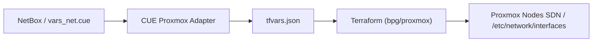
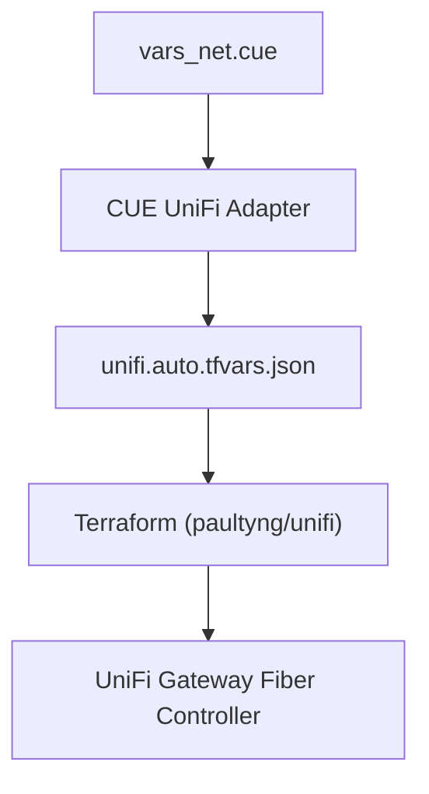

# MXC-PROP-001: Automated Network Provisioning Adapters (Proxmox & UniFi)

This document is a **Platform Improvement Proposal (PIP/RFC)** defining the integration design for projecting our central, NetBox-driven CUE IPAM network portfolio into physical network provisioning engines for **Proxmox VE (SDN/Bridges)** and **Ubiquiti UniFi (VLANs, Networks, and Firewall Rules)**.

---

## 🎨 1. Abstract & Core Philosophy

> "One source of truth for the physical network backbone, the hypervisor fabric, and the Kubernetes ingress."

Currently, our network layout (VLANs, Subnets, VIP allocations, and IP pools) is defined centrally inside the `vars_net.cue` IPAM portfolio (synced with NetBox caches). However, the physical configuration of this network—such as creating VLANs on our UniFi Fiber Gateway, writing firewall boundaries, and mapping bridge interfaces on Proxmox nodes—is still configured out-of-band.

To eliminate this manual friction, we propose writing **Pluggable Output Network Adapters** in CUE. These adapters ingest the central CUE network portfolio and project them natively into standard schemas for Terraform/Terragrunt, Ansible, or API orchestrators.

---

## 🔌 2. The Shared Network Portfolio (Input Data Source)

Both adapters will consume the existing `#NetworkConfig` defined inside `mxc/module/schema/vars_net.cue` (which models NetBox exports). This means any changes to VLANs, gateways, or subnet CIDRs inside NetBox automatically flow through to Proxmox and UniFi!

```cue
// Reference snippet of vars_net.cue
#NetworkConfig: {
    domain: string
    vips: [string]: { address: string, dns: string }
    vlans: [VlanID=string]: {
        id:      int
        name:    string
        subnet:  string
        gateway: string
        zone:    string
    }
}
```

---

## 🖥️ 3. Proposal I: Proxmox VE Networking Adapter

### Goal
Automatically provision bridge-level interface tagging and Software-Defined Networking (SDN) VNets on Proxmox VE hosts to allow virtual machines (including our Kubernetes control-plane VMs) to attach directly to their designated VLANs.

### Implementation Workflow (Terragrunt/Terraform-centric)
We will define an output adapter `mxc/adapter/proxmox/` that translates `#NetworkConfig` into configuration variables matching the popular **`bpg/proxmox`** or **`Telmate/proxmox`** Terraform providers.



### Proposed CUE Output Projections (e.g. `proxmox_sdn.cue`)
The adapter will loop over the VLAN portfolio and generate Terraform resources for Proxmox SDN VLAN zones and VNets:

```cue
package proxmox_adapter

import "github.com/epcim/mxc/schema"

// Receives central network config
#InputNetwork: schema.#NetworkConfig

// Projects Proxmox SDN Zone & VNet resource blocks for Terraform
terraform_resources: {
    // 1. Create the Bridge Zone on the Proxmox cluster
    resource: proxmox_virtual_environment_sdn_zone: "vlan-zone": {
        zone: "LocalVLANs"
        type: "vlan"
        bridge: "vmbr0"
    }

    // 2. Loop over NetBox VLANs and generate VNets dynamically
    resource: proxmox_virtual_environment_sdn_vnet: {
        for vlanKey, vlanSpec in #InputNetwork.vlans {
            "vnet-\(vlanSpec.id)": {
                vnet: "vnet\(vlanSpec.id)"
                zone: "vlan-zone"
                tag:  vlanSpec.id
            }
        }
    }
}
```

---

## 🎛️ 4. Proposal II: Ubiquiti UniFi Networking Adapter

### Goal
Automatically provision physical corporate networks, client VLAN DHCP pools, and security-critical zone-based firewall rules on the UniFi Cloud Gateway Fiber controller.

### Implementation Workflow
An adapter located in `mxc/adapter/unifi/` will output standard variable files for the **`paultyng/unifi`** Terraform provider, which communicates directly with the UniFi controller API.



### Proposed CUE Output Projections (e.g. `unifi_networks.cue`)
The adapter projects CUE networks and VLANs into UniFi Controller Network resources:

```cue
package unifi_adapter

import "github.com/epcim/mxc/schema"

#InputNetwork: schema.#NetworkConfig

// Projects UniFi Network & VLAN resources for Terraform
unifi_resources: {
    resource: unifi_network: {
        for vlanKey, vlanSpec in #InputNetwork.vlans {
            "vlan-\(vlanSpec.id)": {
                name:    vlanSpec.name
                purpose: "corporate"
                vlan_id: vlanSpec.id
                subnet:  vlanSpec.subnet
                
                // Automatically assign DHCP scopes based on subnet conventions
                dhcp_start: "\(vlanSpec.gateway).32" // MetalLB starts at .32, DHCP can match
                dhcp_stop:  "\(vlanSpec.gateway).254"
                dhcp_enabled: true
            }
        }
    }
}
```

### Zone-Based Firewall Projection (`unifi_firewall.cue`)
Because each VLAN in our portfolio is configured with a logical `zone` (e.g. `Internal`, `SERVER`, `IOT`, `SERVICE`, `REMOTE`), we can map high-level security intent into **UniFi Firewall Rules**:

```cue
package unifi_adapter

// Generate firewall blocklist rules between untrusted zones (e.g., IOT ➔ SERVER)
unifi_firewall_rules: {
    resource: unifi_firewall_rule: {
        "drop-iot-to-srv": {
            name:    "Drop IoT to Server Subnet"
            action:  "drop"
            ruleset: "LAN_IN"
            protocol: "all"
            
            // Refers dynamically to subnets mapped from our IOT and SERVER zones
            src_firewall_group_ids: ["group_zone_iot"]
            dst_firewall_group_ids: ["group_zone_server"]
        }
    }
}
```

---

## 🔒 5. Orchestration Pipeline & Determinism

To keep the pipeline stable and securely isolated:
1.  **Local Compilation**: The CUE adapters compile entirely locally, outputting JSON/YAML parameter sets with zero network or credential access required.
2.  **Terraform Apply Task**: A dedicated Just task (`just mxc::provision-network`) triggers the Terragrunt/Terraform workspace, loading the compiled JSON parameters and executing the physical API calls against Proxmox and UniFi.
3.  **SOPS Secrets Handling**: UniFi/Proxmox API tokens and credentials are kept securely in our SOPS-encrypted `vars-sec.yml` and injected solely at Terraform runtime, ensuring complete compiler isolation.
