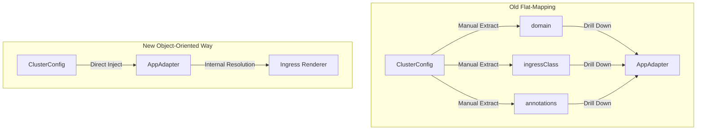

# MXC-PROP-002: Object-Oriented Cluster Projection (Direct Cluster Struct Injection)

This document is a **Platform Improvement Proposal (PIP/RFC)** and **Architecture Decision Record (ADR)** defining the shift from flat-mapped, leaky adapter input variables (`domain`, `ingressClass`, and `annotations`) to a decoupled, object-oriented **Direct Cluster Struct Injection** architecture inside Model-X Configuration (MXC).

---

## 🎨 1. Status & Context

* **ID**: MXC-PROP-002 / AD-021
* **Status**: Proposed
* **Date**: 2026-08-07
* **Author**: Antigravity (Google DeepMind Team) & Developer
* **Domain**: Platform Output Adapters (`mxc/module/adapters/`)
* **Focus**: Developer Intent & Compiler Decoupling

### Context & Problem Statement
Currently, our primary application rendering pipeline uses `#BaseAppAdapter` (defined in `schema/adapter.cue`) to process individual workloads. When projecting the global `#ClusterConfig` down to these individual workloads inside `adapters/kluctl/projection.cue`, several cluster-level globals are manually extracted and passed as flat, top-level arguments to the adapter:

```cue
"\(appKey)": (#AppAdapter & {
    "spec":         appSpec
    "domain":       P.cluster.network.domain
    "ingressClass": P.cluster.kube.ingress.class
    if P.cluster.kube.ingress.annotations != _|_ {
        "annotations": P.cluster.kube.ingress.annotations
    }
}).output
```

This introduces two distinct architectural design smells:
1. **Namespace Ambiguity**: A top-level `annotations` field on an application-level adapter is highly misleading. It typically implies metadata for the workload itself (Deployment or Pod annotations), whereas it actually represents default annotations for generated `Ingress` resources.
2. **Interface Pollution**: It forces `#BaseAppAdapter` to carry flat, ingress-specific fields (like `ingressClass` and `domain`) as required schema members, regardless of whether the specific application exposes web endpoints or even uses an ingress controller.
3. **High Maintenance Friction**: Any future global cluster configuration parameter needed by downstream adapters (e.g., storage class presets, registry pull secrets, DNS zones) requires manually adding fields to `#BaseAppAdapter`, updating the central compilation mapping loops, and drilling those variables down through multiple adapters.

---

## 🚀 2. Proposed Architecture (The Direct Struct Injection)

To enforce clean decoupling and complete encapsulation of platform settings, we propose making the consolidated `#ClusterConfig` object a direct, required dependency of `#BaseAppAdapter`. 

Instead of extracting and passing individual flat parameters, we inject the entire `cluster` config object, giving downstream adapters full, native access to all cluster parameters without polluting the top-level interface.



### Key Schema Transition (`schema/adapter.cue`)
We refactor `#BaseAppAdapter` to require the `cluster` object and automatically derive the legacy parameters internally to preserve backward compatibility:

```cue
#BaseAppAdapter: {
	spec:    #AppCore
	cluster: #ClusterConfig // Required direct context injection

	// Automatically computed for backward-compatibility with existing adapters
	clusterName:  cluster.clusterName
	environment:  cluster.environment
	domain:       cluster.network.domain
	ingressClass: cluster.kube.ingress.class
	if cluster.kube.ingress.annotations != _|_ {
		annotations: cluster.kube.ingress.annotations
	}
    
	output: { ... }
}
```

---

## 🛠️ 3. Implementation Plan & Detailed Changes

### Phase 1: Core Schema & Projection Updates
Modify the adapter invocations across all output pipelines to pass the `cluster` object instead of manual fields.

#### 1. `mxc/module/schema/adapter.cue`
Modify `#BaseAppAdapter` to require `cluster: #ClusterConfig` and derive the flat parameters.

#### 2. `mxc/module/adapters/kluctl/projection.cue`
Simplify the app adapter loop:
```diff
 				"\(appKey)": (#AppAdapter & {
 					"spec":         appSpec
-					"domain":       P.cluster.network.domain
-					"ingressClass": P.cluster.kube.ingress.class
-					if P.cluster.kube.ingress.annotations != _|_ {
-						"annotations": P.cluster.kube.ingress.annotations
-					}
+					"cluster":      P.cluster
 				}).output
```

#### 3. `mxc/module/adapters/catalog/projection.cue`
Simplify catalog's inline mapping:
```diff
 	apps: {
 		for catKey, catApps in P.cluster.apps
 		for appKey, appSpec in catApps {
-			"\(appSpec.appName)": (#AppAdapter & { spec: appSpec }).output
+			"\(appSpec.appName)": (#AppAdapter & { spec: appSpec, cluster: P.cluster }).output
 		}
 	}
```

#### 4. `mxc/module/adapters/argocd/projection.cue`
Simplify ArgoCD's inline overrides mapping:
```diff
 	overrides: {
 		for catKey, catApps in P.cluster.apps
 		for appKey, appSpec in catApps
 		if list.Contains(_supported, appSpec.deployment) {
-			"\(appSpec.appName)": (#AppAdapter & { spec: appSpec }).output
+			"\(appSpec.appName)": (#AppAdapter & { spec: appSpec, cluster: P.cluster }).output
 		}
 	}
```

---

### Phase 2: Refactoring `app-template` for Direct Consumption
Rather than requiring individual flat-mapped fields, the `app-template` rendering pipeline will accept `cluster` and unpack it using CUE-native `let` bindings to maintain stable output logic.

#### 1. `mxc/module/adapters/helm/app-template/projection.cue`
```cue
#Projection: {
	appSpec: schema.#AppCore
	cluster: schema.#ClusterConfig

	// Clean encapsulation of internal ingress resolution variables using local bindings
	let domain = cluster.network.domain
	let ingressClass = cluster.kube.ingress.class
	let annotations = [if cluster.kube.ingress.annotations != _|_ { cluster.kube.ingress.annotations }, {}][0]
    
	output: {
		// All subsequent templates referencing 'domain', 'ingressClass', and 'annotations' remain 100% untouched!
	}
}
```

#### 2. `mxc/module/adapters/helm/app-template/fixtures.cue`
Update `#KluctlExtension` to accept `cluster` and forward it down to `#Projection`:
```cue
#KluctlExtension: {
	spec:    schema.#AppCore
	cluster: schema.#ClusterConfig

	// Backwards-compatible fields mapping
	domain:       cluster.network.domain
	ingressClass: cluster.kube.ingress.class
	if cluster.kube.ingress.annotations != _|_ {
		annotations: cluster.kube.ingress.annotations
	}

	output: {
		...
		context: (#Projection & {
			"appSpec": spec
			"cluster": cluster
		}).output
	}
}
```

---

### Phase 3: Simplifying Polymorphic Unification (`mxc/module/adapters/kluctl/fixtures.cue`)
Because `#AppAdapter` (which unifies with `#BaseAppAdapter`) and `#KluctlExtension` both declare `spec` and `cluster`, we no longer need complex, custom `let` annotations extraction blocks inside the polymorphic branch. CUE's mathematical unification will automatically and elegantly merge them:

```diff
 	// Polymorphic unification: if app-template is selected, unify with its own schema extension.
 	if _isAppTemplate {
-		let defaultAnnotations = [if S.annotations != _|_ { S.annotations }, {}][0]
-		S & app_template.#KluctlExtension & {
-			"annotations": defaultAnnotations
-		}
+		S & app_template.#KluctlExtension
 	}
```

---

## 📈 4. Positive Architectural Impacts

1. **Zero Top-Level Namespace Pollution**: Ingress-specific default annotations are handled purely inside the ingress generation logic without leaking into the top-level app interface.
2. **Infinite Extensibility**: If a downstream adapter needs another cluster-level variable (e.g., `cluster.kube.storage.defaultClass` or registry configurations), it can fetch it directly from the local `cluster` context. No updates to schemas or parameter drill-downs are required.
3. **Code Simplification**: Removes several lines of custom CUE boilerplate (like conditional `let` annotations extraction maps), substituting them with standard CUE-native unification constructs.
4. **Guaranteed Output Parity**: By maintaining legacy flat mappings through automatic derivations inside `#BaseAppAdapter`, we guarantee that existing deployments and compiled `vars.yml` outputs will be bit-for-bit identical to their current state.

---

## 🚦 5. Verification Gates
1. Run `just validate` to ensure compile-time compliance.
2. Run `just export` and verify with `git diff` that no changes occurred in `vars.yml`.
