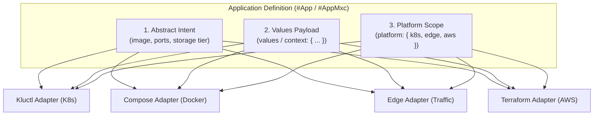

# MXC-PROP-004: Target Platform Adaptation and Multi-Plane Bindings

* **Status:** Proposed / Implemented
* **Author:** Platform Architecture Team
* **Created:** 2026-08-18
* **Scope:** Core Schema (`module/schema/platform.cue`, `module/schema/platforms/`), Workload Contract (`#App`, `#AppMxc`), Cluster Facets (`#WithPlatform`), Multi-Plane Adapters

---

## 1. Context & Motivation

Historically, Model-X Configuration (MXC) modeled platform infrastructure capabilities primarily through Kubernetes-centric facets (`#WithKube`, `#WithNetwork`, `mxc_k8s.#ExposeSpec`, `mxc_k8s.#StorageSpec`).

While this worked effectively for single-cluster GitOps setups using Kluctl and Helm, it introduced architectural coupling:
1. **Leaky Runtime Abstractions**: Fields like `expose.<port>.ingressClass` or storage class names leaked Kubernetes controller concepts into high-level workload definitions.
2. **Multi-Platform Proliferation**: Modern workloads frequently deploy across multiple targets (Kubernetes clusters, Docker Compose nodes, Cloud object storage/databases, Mirantis K0rdent service templates, and Edge/CDN traffic planes).
3. **Multi-Plane Coordination**: A single logical application (e.g. `dns-service` or `media-server`) often requires coordination across multiple distinct planes:
   - **Runtime Plane**: Pods, containers, and services running in Kubernetes (`platform.k8s`) or Compose (`platform.compose`).
   - **Edge / Traffic Plane**: Anycast VIPs, WAF rules, and CDN routing (`platform.edge`).
   - **Cloud Infrastructure Plane**: S3 buckets, IAM roles, and RDS databases (`platform.aws` / `platform.cloud`).

---

## 2. Core Architecture: The "Rule of Three Buckets"

To decouple workload specification from deployment runtime details without creating boilerplate, MXC structures workload configuration into three orthogonal layers:

```
┌─────────────────────────────────────────────────────────────────────────────────────────┐
│                                   The Three Buckets                                    │
├─────────────────────────────────────────────────────────────────────────────────────────┤
│ 1. Abstract Intent       │ `appName`, `image`, `ports`, `expose`, `storage: {size, tier}│
│    (Platform-Agnostic)   │ Describes WHAT the application is logically.                 │
├──────────────────────────┼──────────────────────────────────────────────────────────────┤
│ 2. Workload Values Bag   │ `values` (with `context` as 1:1 symmetric alias)             │
│    (Polymorphic Payload) │ Open configuration parameters delivered to the target engine │
│                          │ (Helm values, Compose environment, or Terraform tfvars).     │
├──────────────────────────┼──────────────────────────────────────────────────────────────┤
│ 3. Platform Adaptation   │ `platform: { k8s, compose, edge, cloud, k0rdent, ... }`     │
│    (Target Requirements) │ Platform-specific placements, namespaces, drivers & escapes. │
└──────────────────────────┴──────────────────────────────────────────────────────────────┘
```



---

## 3. Platform Domains vs. Tool Engines Taxonomy

Platform configuration is strictly categorized into **Infrastructure Target Domains** (where resources live) and **Scoped Tooling Engines** (how they are packaged/rendered):

| Layer | Path | Description |
| :--- | :--- | :--- |
| **Target Infrastructure Domain** | `platform.k8s` | Kubernetes cluster execution environment |
| | `platform.compose` | Docker Engine / Compose host environment |
| | `platform.edge` | Edge Anycast LB, WAF, CDN, and traffic mesh |
| | `platform.aws` / `platform.cloud` | Cloud provider infrastructure and IAM |
| **Scoped Tooling Engine** | `platform.k8s.kustomize` | Kubernetes Kustomize patches & overlays |
| | `platform.k8s.helmChart` | Kubernetes native Helm chart coordinates |
| | `platform.aws.terraform` | AWS-scoped Terraform/OpenTofu module |
| | `platform.edge.terragrunt` | Edge-scoped Terragrunt live configuration |
| **Generic Tooling Engine** | `platform.terraform` | Cross-domain multi-provider Terraform module |

---

## 4. CUE Schema Implementation

### 4.1. Core Platform Primitive (`schema/platform.cue`)

```cue
package schema

#Platform: {
	k8s?:     platforms.#PlatformK8s
	compose?: platforms.#PlatformCompose
	aws?:     platforms.#PlatformAWS
	k0rdent?: platforms.#PlatformK0rdent

	terraform?: {
		backend?: string
		providers?: [...string]
		[string]: _
	}

	env?: [string]: string

	// Open seam for user-defined platforms
	...
}
```

### 4.2. Kubernetes Platform Scope (`schema/platforms/k8s.cue`)

```cue
package platforms

#PlatformK8s: {
	clusterName?:  string
	namespace?:    string
	distribution?: "talos" | "k3s" | "microk8s" | "eks" | "gke" | "kwok" | string | *"k8s"

	storage?: {
		defaultClass: string | *"local-path"
		classes?: [string]: string
	}

	ingress?: {
		provider?:    string | *"traefik"
		class?:       string | *"traefik"
		annotations?: [string]: string
	}

	kustomize?: external.#Kustomization
	helmChart?: external.#HelmChartSpec
	...
}
```

### 4.3. Non-Breaking Escape Hatch Bridging (`schema/apps.cue`)

To preserve 100% backward compatibility for existing cluster repositories, root-level `kustomize` and `k0rdent` fields on `#AppMxc` automatically unify with their canonical platform scopes:

```cue
#AppMxc: #App & {
	kustomize?: external.#Kustomization
	k0rdent?:   _

	if kustomize != _|_ {
		platform: k8s: kustomize: kustomize
	}
	if k0rdent != _|_ {
		platform: k0rdent: k0rdent
	}
	...
}
```

---

## 5. Multi-Adapter Composition & Execution

### 5.1. User Binding in `globals.cue`

Users instantiate upstream and local custom adapters inside an open `adapters` registry:

```cue
package mxc

import (
	schema "github.com/epcim/mxc/schema:schema"
	adp_kluctl  "github.com/epcim/mxc/adapters/kluctl:kluctl"
	adp_argocd  "github.com/epcim/mxc/adapters/argocd:argocd"
	adp_catalog "github.com/epcim/mxc/adapters/catalog:catalog"
	adp_edge    "./adapters/edge:edge"
)

cluster: schema.#ClusterConfig & { ... }

adapters: {
	kluctl:  adp_kluctl.#Projection  & { "cluster": cluster }
	argocd:  adp_argocd.#Projection  & { "cluster": cluster }
	catalog: adp_catalog.#Projection & { "cluster": cluster }
	edge:    adp_edge.#Projection    & { "cluster": cluster }
}

mxc_vars: adapters.kluctl.output
```

### 5.2. Invoking Adapters & Output File Naming (`vars-<adapter>.yml`)

To prevent deployer tool collisions (e.g. Kluctl attempting to parse Terraform state, or Terraform parsing K8s JSON patch manifests), MXC defines the **Adapter-Scoped Output File Convention**:

* **Standard Scoped Files**: Each active adapter exports its payload to an isolated, tool-specific file:
  * `vars-kluctl.yml` (or legacy `vars.yml` for Kluctl)
  * `vars-compose.yml` (for Docker Compose)
  * `vars-tf.json` (for Terraform / OpenTofu)
  * `vars-edge.yml` (for Edge CDN/Traffic controllers)
* **Single Source of Truth**: All adapters are addressed via `adapters.<name>.output`.
* **Deprecation of `mxc_vars`**: `mxc_vars` is retained as a backward-compatibility alias (`mxc_vars: adapters.kluctl.output`) and will be gradually phased out.

```bash
# Export standard Kluctl variables (defaulting to vars.yml / vars-kluctl.yml)
just export cluster-home-mxc

# Export specific adapter output
just export cluster-home-mxc adapters.compose.output

# Export ArgoCD ApplicationSets
just export-argocd cluster-home-mxc

# Export custom or local adapter directly via CUE
cue export -e "adapters.edge.output" --out json > vars-edge.json
```

---

## 6. Migration & Compatibility

1. **Zero Breaking Changes**: Existing cluster configurations referencing `kube:`, `network:`, and root-level `kustomize:` continue to compile and validate without modifications.
2. **Gradual Adoption**: Teams can adopt `platform.k8s`, `platform.edge`, or `platform.aws` on new or migrated workloads incrementally.
3. **Tool Autonomy**: Adapters activate conditionally when their respective platform block is present.
4. **`mxc_vars` Backward Compatibility**: `mxc_vars` remains an alias to `adapters.kluctl.output` for all existing Kluctl Jinja deployment workflows.

