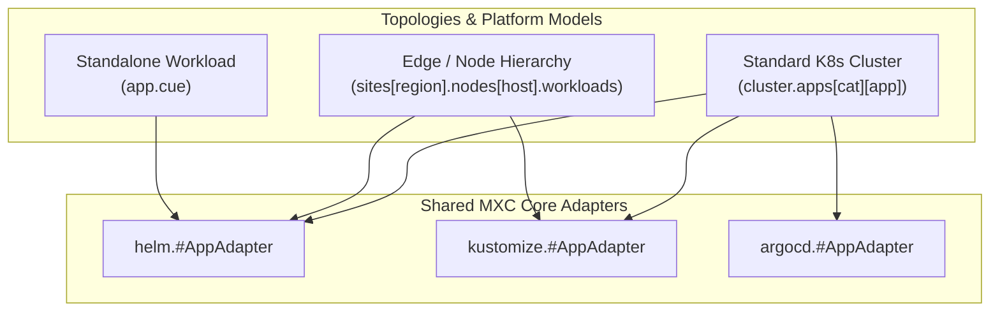
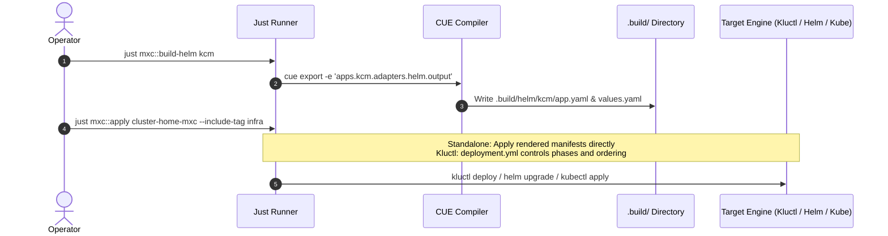

# MXC-PROP-005: Per-App Adapter Architecture, Decoupled Topologies, and Independent Build Pipelines

* **Status:** Proposed / Under Review
* **Author:** Platform Architecture Team
* **Created:** 2026-08-20
* **Scope:** Core Adapters (`module/adapters/`), Schema Primitives (`schema/#AppAdapter`, `schema/#ClusterContext`), Topology Decoupling, Build & Apply Lifecycles

---

## 1. Context & Problem Statement

Currently, Model-X Configuration (MXC) adapters (`helm`, `kustomize`, `kluctl`, `argocd`, `catalog`) define cluster-level projections (`#Projection`) that iterate over the two-level cluster application tree:

```
P.cluster.apps: {
    [category: string]: {
        [app: string]: #App
    }
}
```

While this design works for whole-cluster monolithic exports (such as exporting a single `vars.yml` for Kluctl), it introduces several architectural limitations:

1. **Topology Coupling**: Adapters depend directly on the specific layout of `P.cluster.apps`. Follow-up platforms, edge deployments, and multi-region topologies (e.g., site/rack/node hierarchies) cannot reuse the adapters without duplicating code.
2. **Evaluation Overhead**: Rendering or diffing a single application (e.g., `just mxc::build-helm kcm`) requires CUE to evaluate the entire cluster graph and loop over all applications.
3. **Monolithic Projections**: Filtering by tags and platform targets is mixed inside adapter loop logic instead of being a modular query lens.

---

## 2. Core Architecture: Decoupled `#AppAdapter`

### 2.1 The Single-App Contract

The fundamental unit of adaptation in MXC is redesigned to be the **Single Application Adapter** (`#AppAdapter`):

```
┌──────────────────────────────────────────────────────────────┐
│                         #AppAdapter                          │
├──────────────────────────────┬───────────────────────────────┤
│ Input 1: Application Spec    │ `spec: #App`                  │
│ Input 2: Context (Optional)  │ `context?: #ClusterContext`   │
├──────────────────────────────┼───────────────────────────────┤
│ Output: Rendered Artifacts   │ `output: { ... }`             │
└──────────────────────────────┴───────────────────────────────┘
```

#### Schema Definition (`schema/adapter.cue`)

```cue
package schema

// #ClusterContext encapsulates environment values required by adapters
#ClusterContext: {
	domain?:       string
	ingressClass?: string
	storage?:      [string]: string
	vips?:         [string]: string
	secrets?:      _
	...
}

// #BaseAppAdapter is the standard base for all single-app adapters
#BaseAppAdapter: {
	spec:     #App
	context?: #ClusterContext
	output:   _
}
```

#### Adapter Implementation Example (`adapters/helm/projection.cue`)

```cue
package helm

import "github.com/epcim/mxc/schema"

// #AppAdapter transforms a single application specification into Helm parameters
#AppAdapter: S=schema.#BaseAppAdapter & {
	output: {
		appName: S.spec.appName
		adapter: S.spec.adapter
		if S.spec.tags != _|_ {tags: S.spec.tags}

		if S.spec.helmChart != _|_ {
			helmChart: S.spec.helmChart
		}

		if S.spec.values != _|_ {
			values: S.spec.values
		}

		if S.spec.kustomize != _|_ {
			kustomize: S.spec.kustomize
		}
	}
}
```

---

## 3. Decoupled Topologies & Cross-Project Reusability

By removing the hardcoded `P.cluster.apps` iteration from adapters, any system or topology model can reuse MXC adapters directly:



### Example: Edge Topology Reusing Helm Adapter

```cue
package edge_site

import (
	adp_helm "github.com/epcim/mxc/module/adapters/helm"
	stk_infra "github.com/epcim/mxc-library/stacks/infra"
)

site: {
	name:   "edge-prague-01"
	domain: "prg01.edge.apealive.net"
	nodes: {
		"node-01": {
			workloads: {
				kcm: stk_infra.#K0rdent
			}
			// Direct per-app adapter rendering using local site context
			helmOutputs: {
				kcm: (adp_helm.#AppAdapter & {
					spec: workloads.kcm
					context: { domain: site.domain }
				}).output
			}
		}
	}
}
```

---

## 4. Cluster Aggregation & Selection Lens

Cluster definitions (e.g., `cluster-home-mxc`, `cluster-test`) or root MXC packages maintain a thin aggregation and selection layer.

### 4.1 Selection Lens (`schema/selection.cue`)

The `#Selection` lens queries and filters applications based on tags and names:

```cue
package schema

import "list"

#Selection: {
	apps: [...#App]
	includeTags: [...string] | *[]
	excludeTags: [...string] | *[]
	includeApps: [...string] | *[]

	selected: [
		for app in apps
		let appTags = [if app.tags != _|_ {app.tags}, []][0]
		let tagMatch = len(includeTags) == 0 || len([for t in includeTags if list.Contains(appTags, t) {t}]) > 0
		let tagExclude = len(excludeTags) > 0 && len([for t in excludeTags if list.Contains(appTags, t) {t}]) > 0
		let nameMatch = len(includeApps) == 0 || list.Contains(includeApps, app.appName)

		if tagMatch && !tagExclude && nameMatch {
			app
		}
	]
}
```

### 4.2 Cluster-Level Collector (`cluster/adapters.cue`)

The cluster projection becomes a clear, declarative collector over all configured workloads:

```cue
package cluster

// Flat list of all workloads in cluster
_allApps: [
	for catKey, catApps in cluster.apps
	for appKey, appSpec in catApps {
		appSpec
	}
]

// Cluster-wide outputs
adapters: {
	// Kluctl legacy export (vars.yml)
	kluctl_vars: {
		for app in _allApps {
			"\(app.appName)": (adp_kluctl.#AppAdapter & {
				spec: app
				context: clusterContext
			}).output
		}
	}

	// ArgoCD multi-application list
	argocd_apps: [
		for app in _allApps if app.adapter == "argocd" {
			(adp_argocd.#AppAdapter & {
				spec: app
				context: clusterContext
			}).output
		}
	]

	// Global discovery catalog
	catalog: [
		for app in _allApps {
			(adp_catalog.#AppAdapter & {
				spec: app
				context: clusterContext
			}).output
		}
	]
}
```

---

## 5. Granular Build & Apply Lifecycle

The workflow separates **Build / Render** from **Order & Execution**:



### 5.1 Build / Render Phase
- Manifests render into isolated subdirectories:
  - `.build/helm/<app>/app.yaml` + `values.yaml`
  - `.build/kustomize/<app>/kustomization.yaml` + `mxc-overlays.yaml`
- Each app renders in isolation with $O(1)$ complexity.

### 5.2 Apply / Execution Phase
- **Standalone Apps (Helm / Kustomize)**: Applied directly by the Just runner.
- **Kluctl Clusters**: `deployment.yml` defines execution phases, barrier gates, dependencies, and deployment ordering. Manifest values are supplied from `.build/` or rendered variables.

---

## 6. Benefits Matrix

| Aspect | Current Model (Cluster Iteration) | Proposed Model (Per-App Adapter) |
|---|---|---|
| **Adapter Signature** | `#Projection: { cluster: #Cluster, output: _ }` | `#AppAdapter: { spec: #App, context?: #ClusterContext }` |
| **Topology Coupling** | High (tied to `cluster.apps[cat][app]`) | None (usable with any topology/node structure) |
| **Single-App Build** | $O(N)$ (evaluates entire cluster) | $O(1)$ (evaluates single app) |
| **Tag Filtering** | Hardcoded inside adapter loops | Composable via `#Selection` lens or CLI query |
| **Reusability** | MXC cluster only | Generic CUE packages and multi-project pipelines |
| **Testing** | Requires full cluster fixture | Unit testable with a single `#App` struct |

---

## 7. Next Steps & Decision Plan

1. **Review & Discussion**: Evaluate interface shape of `#ClusterContext` and `#AppAdapter`.
2. **Pilot Implementation**: Update `module/adapters/helm/` and `module/adapters/kustomize/` with `#AppAdapter` signatures while retaining `#Projection` as backward-compatible wrapper.
3. **Benchmark**: Measure CUE compilation speed for single-app exports in large environments.
